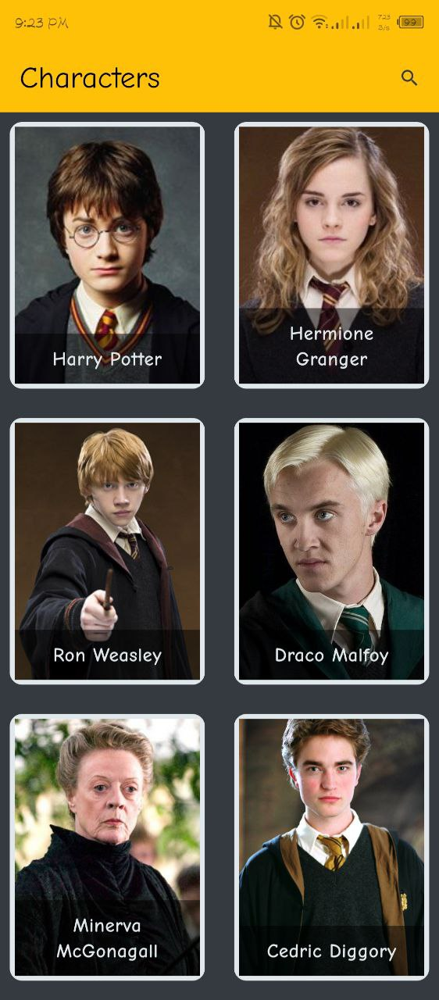
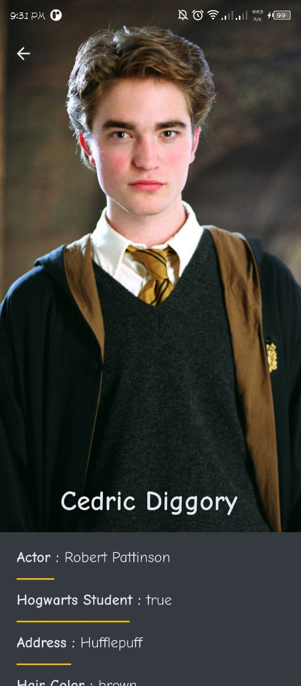
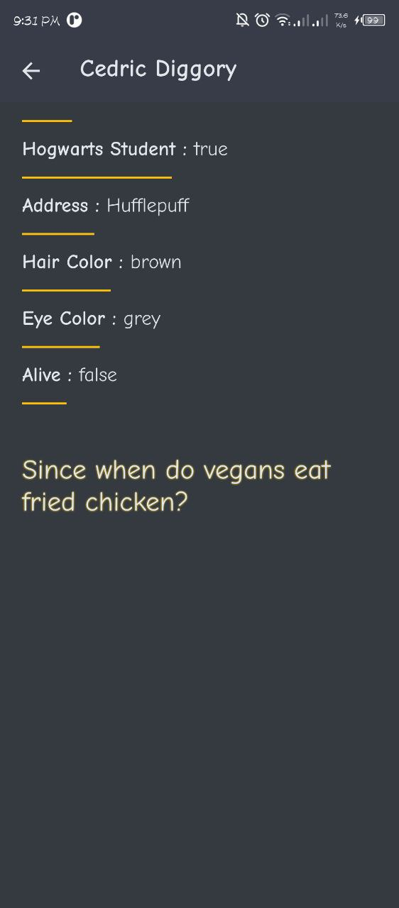
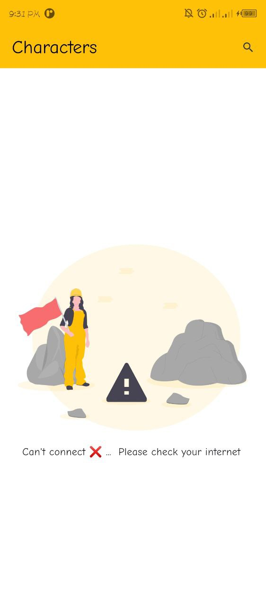
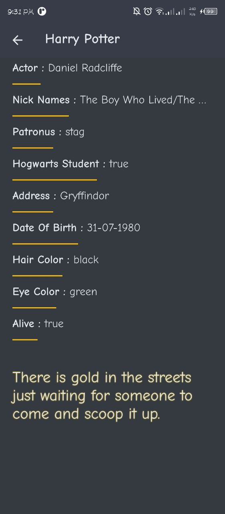

# 🧙‍♂️ Harry Potter Characters App

A simple and clean app built using **Flutter**.  
It fetches Harry Potter characters and displays their details like name,patronus, house, gender, eye color, hair color, and if they are alive or not.

---

## 📱 Features

- 🔍 Search characters by name
- 🦉 Hero animations for smooth screen transitions
- 📴 Offline detection and handling
- ✨ Animated text effects
- 🏠 Display detailed character information (house, status, etc.)
- 🛡 Robust state management with **Cubit (Bloc Pattern)**

---

## 🛠 Tech Stack

- **Flutter**
- **Dart**
- **Dio (HTTP Requests)**
- **Cubit / BLoC (State Management)**
- **flutter_offline** (Offline detection)
- **animated_text_kit** (Text animations)

---

## 📦 Packages Used

| Package               | Purpose                      |
|------------------------|-------------------------------|
| `dio`                 | API requests                  |
| `flutter_offline`     | Internet connection detection  |
| `animated_text_kit`   | Beautiful text animations      |
| `flutter_bloc`        | State management with Cubit     |

---

## 🚀 How to Run

```bash
# 1. Clone the repository
git clone https://github.com/your-username/harry_potter_characters.git
cd harry_potter_characters

# 2. Install dependencies
flutter pub get

# 3. Run the app
flutter run
```

📸 Screenshots:









## License:
This project is licensed under the MIT License - see the LICENSE file for details.

## Developed by
Ahmed Mostafa
GitHub: [@iahmedmostafa](https://github.com/iahmedmostafa)